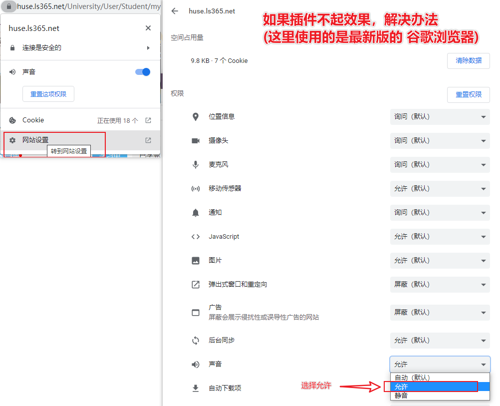
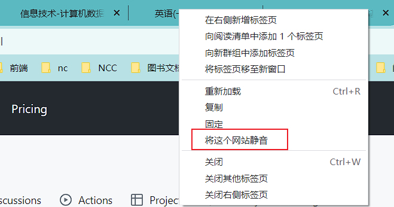

# skipschool

湖南文理学院自动刷课插件(全新版本v3)

## 功能
 - 文理学院成考课程 自动刷课
 - 支持多线程 10倍速 刷课
 - 下载解压后进入谷歌浏览器扩展程序点击加载解压扩展即可自动启用
 - 可以微信搜索 [李大炮工作室] 关注获取后续消息

## 更新
 - 2022-07-07 21:39:25 新增支持 湖南科技学院, 博学BX
 - 2023-09-25 15:55:57 修复刷课时多窗口下无法正常播放, 遇到无法加载资源时可手动跳过
 - 2023-11-17 14:25:15 升级引擎v2 -> v3, 修复遇到视频资源错误时无法向下刷课的问题

## 问题处理

### 未进行正常刷课
浏览器比较吃电脑内存，多窗口进行刷课时，电脑性能跟不上会导致无法正常刷课，此时建议减少多线程数量，也就是关闭一些浏览器窗口

### 页面元素缺失
这种情况多数是开多个窗口(类似多线程)，浏览器负载过高，导致页面元素缺失，通过减少浏览器窗口解决，如不影响刷课可不管

### 刷课脚本没有运行
浏览器打开控制台(F12)没有显示正在刷课时，可进行如下处理：

### 课程资源错误问题处理
网站资源无法加载导致无法播放，选择下一个视频即可继续自动刷课

### 刷课中听到课程声音

### 无法多线程
视频页面切换到后台无法正常继续播放，可以使用多窗口而不是多标签页的形式启动多线程

### 其它问题
可以微信公众号搜索 [李大炮工作室] ，将你遇到的问题发给我